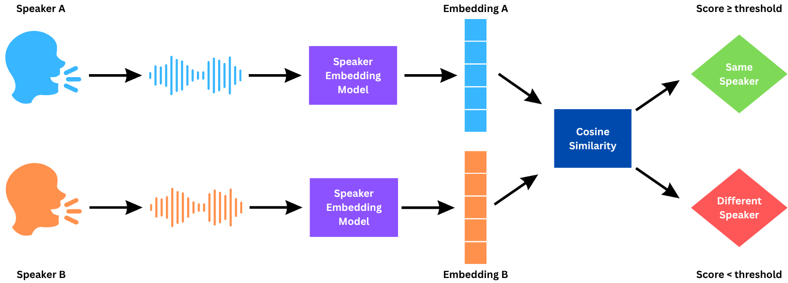
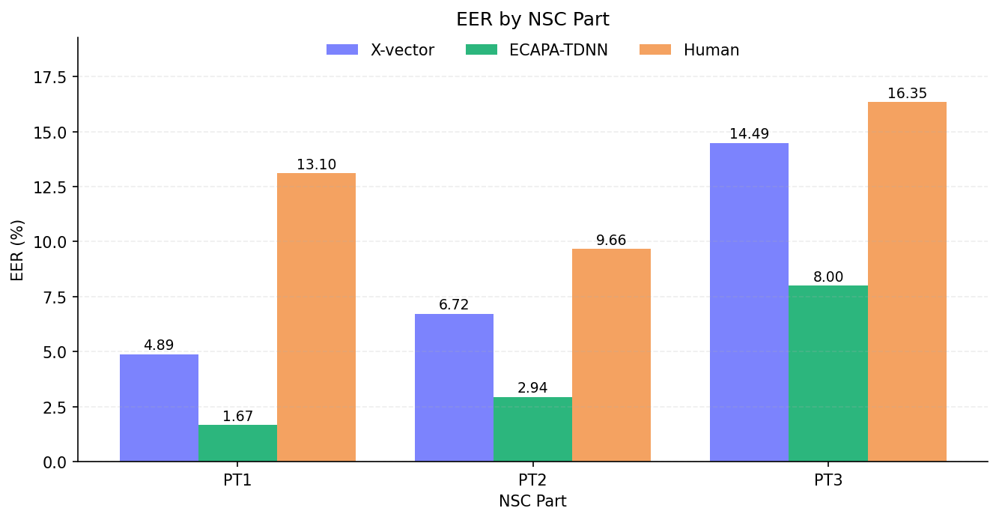

# Forensic Speaker Comparison

Automatic speaker comparison pipeline using ECAPA-TDNN and X-vector embeddings on Singapore English speech data, with per-part evaluation and human-subset sampling.

This repository was developed for **HG4022 Forensic Linguistics** at **Nanyang Technological University (NTU)**.

## Project Objectives

- Build same-speaker and different-speaker trial pairs from Singapore English speech.
- Run off-the-shelf speaker encoders (SpeechBrain ECAPA-TDNN and X-vector).
- Evaluate performance using Accuracy, FPR, FNR, and EER.
- Support comparison with a human listening experiment on sampled pairs.

## Pipeline



## Model Results

EER comparison across NSC parts for X-vector and ECAPA-TDNN:



## Project Layout

- `audio/nsc_pt{1,2,3}_strata/`: stratified audio folders
- `trials/<part>/trials.csv`: generated target/non-target pairs
- `embeddings/<part>/<model>/embeddings.pt`: extracted speaker embeddings
- `results/<part>/<model>/metrics.json`: per-model metrics by NSC part
- `figures/eval/*.png`: cross-part comparison plots

## Setup

```bash
python -m venv .venv
source .venv/bin/activate
pip install -r requirements.txt
```

## Run

1. Generate trials for one part:

```bash
python dataset.py --nsc-part pt1 --audio-root audio
```

2. Extract embeddings (both models):

```bash
python inference.py --nsc-part pt1 --audio-root audio --model all
```

3. Plot model comparison from existing `results/*/*/metrics.json`:

```bash
python plot_eval.py --results-root results --out-dir figures/eval --models xvect ecapa
```

4. Build human listening subset CSVs (default: all 3 parts):

```bash
python human_subset.py --trials-root trials --out-dir "human subsets"
```

## References

- https://huggingface.co/blog/norwooodsystems/ecapa-vs-xvector-speaker-recognition-comparison
