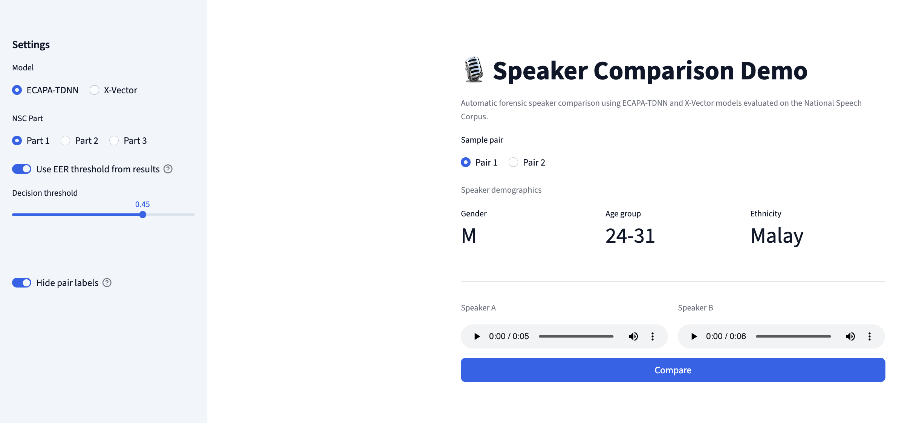

# Forensic Speaker Comparison

Automatic speaker comparison pipeline for Singapore English using ECAPA-TDNN and X-vector, with comparison against human listening results.

This repository was developed for *HG4022 Forensic Linguistics* at **Nanyang Technological University (NTU)**.

## Project Objectives

- Build same-speaker and different-speaker trial pairs from Singapore English speech.
- Run off-the-shelf speaker encoders (SpeechBrain ECAPA-TDNN and X-vector).
- Evaluate performance using Accuracy, FPR, FNR, and EER.
- Compare model performance with human listening experiment results.

## Pipeline


## Example Result

EER comparison across NSC parts:


## Setup

```bash
python -m venv .venv
source .venv/bin/activate
pip install -r requirements.txt
```

## Data Prerequisite

To run the full evaluation pipeline, place NSC audio locally under:

`audio/nsc_pt1_strata`, `audio/nsc_pt2_strata`, `audio/nsc_pt3_strata`

## Core Workflow

1. Generate trials for a part:

```bash
python dataset.py --nsc-part pt1 --audio-root audio
```

2. Extract embeddings:

```bash
python inference.py --nsc-part pt1 --audio-root audio --model all
```

3. Plot evaluation metrics:

```bash
python plot_eval.py --results-root results --trials-root trials --out-dir figures/eval
```

4. Build human listening subset CSVs:

```bash
python human_subset.py --trials-root trials --out-dir "human subsets"
```

If `audio/` is not available locally, you can still run the demo app with the included sample pairs.

## Demo App


Launch Streamlit app from project root:

```bash
streamlit run app.py
```

In the app:

- Choose model (`ECAPA-TDNN` or `X-vector`)
- Choose NSC part (`pt1`, `pt2`, `pt3`)
- Play the two sample audios
- Click `Compare` to get similarity score and decision

## References

- https://huggingface.co/blog/norwooodsystems/ecapa-vs-xvector-speaker-recognition-comparison
